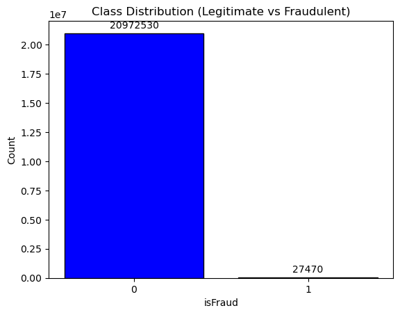

import CodePreview from '../../components/CodePreview.astro';

## Introduction
My first job in the programming world was developing a web application in the cybersecurity world.
After I graduated, I moved to a different team.
This was my first professional exposure to data science.
I was tasked with translating extraction scripts from the SAS programming language to Python.

"After spending those initial months post-graduation focused on the foundational work of data engineering – cleaning, transforming, and structuring raw
information into usable formats for analytics – I felt a strong pull towards seeing that data come alive in predictive models.
It seemed like the logical next step to connect my backend skills with the front-end intelligence.

Fraud detection is one domain where this connection feels particularly vital.
Dealing with potentially massive datasets containing transaction details, user behaviour, and outcomes (often highly imbalanced), it's a prime candidate for ML application.
I've been exploring ways to get involved directly, and recently discovered Hugging Face's `datasets` tool as an excellent way to quickly load structured data like this.

So, combining my recent experience with the fundamentals of machine learning models (XGBoost, LightGBM known for gradient boosting efficiency; MLPs or
neural networks for capturing potentially complex patterns) and leveraging a clean dataset from Hugging Face, I decided to dive in myself. This project
isn't just about training models; it's also an opportunity to learn how different algorithms handle the specific nuances of fraud detection data – like its
inherent imbalance – something my engineering background helps frame but doesn't fully solve.

Join me as I explore these approaches on a real-world (though simplified via Hugging Face) financial dataset, comparing results and reflecting on what each
model brings to the table.

## The Dataset
The dataset I chose is the [Cifer Fraud Detection](https://huggingface.co/datasets/CiferAI/Cifer-Fraud-Detection-Dataset-AF) dataset available on Hugging Face.

It contains 21M rows which is quite substantial for training machine learning models.
The rows are separated in 14 parts which is intended to be use in federated learning but in my case I will just use it as a single dataset.
The data is high quality and structured with features representing transaction details, user behavior, and labels indicating fraudulent activity.
Here are the features as described on the dataset page:
| Feature Name | Description |
|---|---|
| step | Unit of time (1 step = 1 hour); simulation spans 30 days (744 steps total) |
| type | Transaction type: CASH-IN, CASH-OUT, DEBIT, PAYMENT, TRANSFER |
| amount | Transaction value in simulated currency |
| nameOrig | Anonymized ID of sender |
| oldbalanceOrg | Sender’s balance before transaction |
| newbalanceOrig | Sender’s balance after transaction |
| nameDest | Anonymized ID of recipient |
| oldbalanceDest | Recipient’s balance before transaction (if applicable) |
| newbalanceDest | Recipient’s balance after transaction (if applicable) |
| isFraud | Binary flag: 1 if transaction is fraudulent |
| isFlaggedFraud | 1 if transaction exceeds a flagged threshold (e.g. >200,000) |

Evaluating the distribution of classes is crucial in any machine learning task, especially in fraud detection where the class distribution is often highly imbalanced.
In this dataset, we can expect a significant disparity between the number of legitimate transactions and fraudulent ones.

To visualize this, we can create a bar chart showing the counts of each class in the `isFraud` column.
This will help us understand the extent of the imbalance and guide our approach to model training and evaluation.

We can see that the number of legitimate transactions far outweighs the number of fraudulent ones, highlighting the class imbalance issue we need to address.
In fact, 99.8% of the transactions are legitimate, while only 0.2% are fraudulent.
We will have to employ techniques such as resampling, cost-sensitive learning, or anomaly detection to effectively train our models on this imbalanced dataset.
